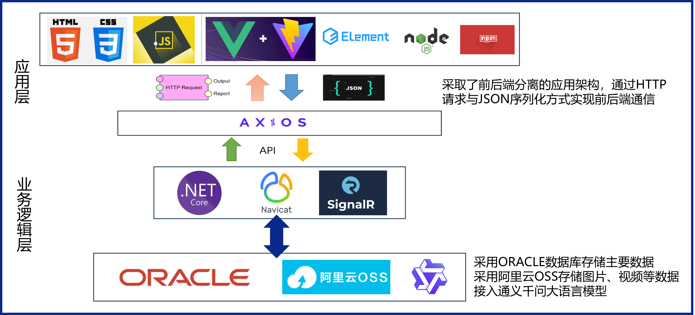
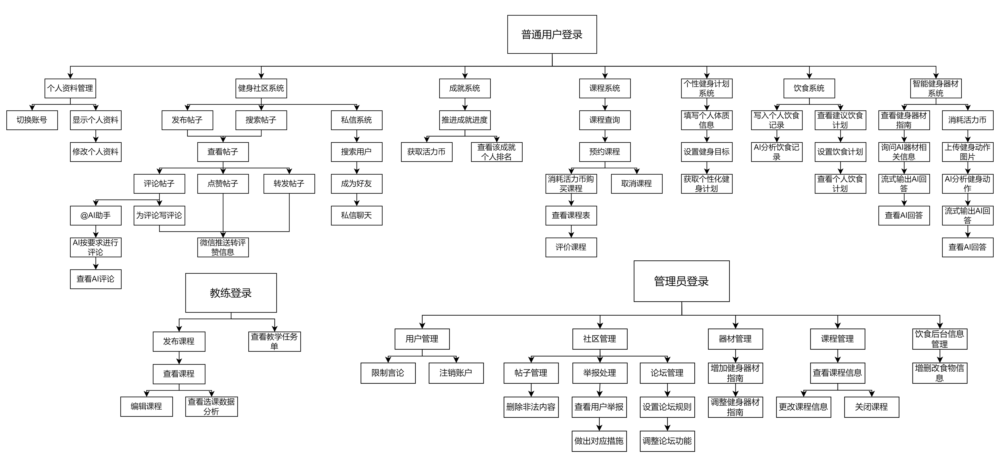
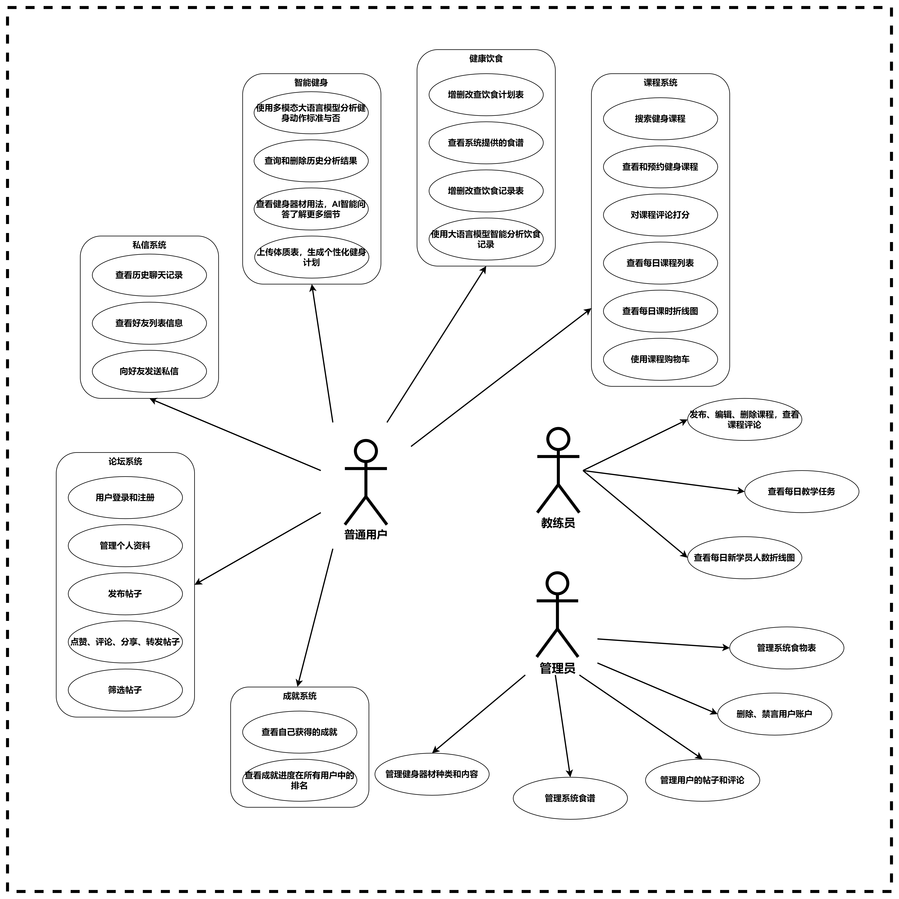
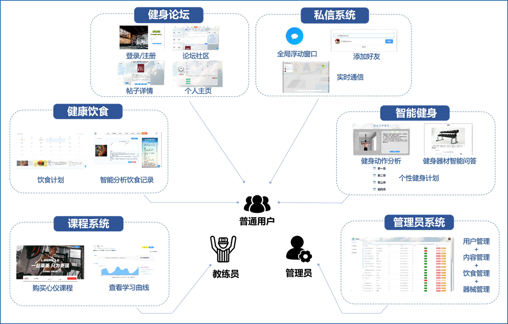

# DB-Course-Design-Fitness

  这里是同济大学软件学院2022级数据库课程设计项目——FitFIt,您的AI健身管家

## 技术栈



## 功能性需求分析



## 总体用例图



## 总体ER图设计


## 功能矩阵图



## 项目目录结构说明

```bash
+---backEnd   # 后端项目工程源代码
|   +---Fitness
|   |   +---App_Data # 秘钥信息储存（已隐藏）
|   |   +---Controllers # API接口
|   |   +---Hubs #SignalR实时通信后端实现 
|   |   \---Properties #配置信息
|   +---Fitness.BLL #业务逻辑层代码
|   |   +---Core #工具类
|   |   +---Interfaces #业务层接口
|   +---Fitness.DAL #数据访问层代码
|   |   +---Core #工具类
|   \---Fitness.Models #后端使用的一些类
+---Doc  # 一些学习与设计文档 （并非最终版与完整版）
|   +---Design
|   \---Learning
+---DocImgRes  # Markdown文档图片资源
+---frontEnd  # 前端项目工程源代码
|   +---public # 一些资源
|   \---src # 前端核心代码
|       +---assets
|       +---components # 自定义组件
|       +---mixins  # 共享操作
|       +---router # 路由
|       +---store # 全局共享的操作与状态
|       \---views # 自定义视图文件
\---SQL # 数据库建表sql文件（并非最终版与完整版）
```

## 如何运行

这里来个极简版：

首先，搭好服务器并重建Oracle数据库，修改后端连接数据库、OSS服务、大模型API调用、SMTP服务的相关密钥信息；

其次，Git clone 本项目至本地

- 后端项目运行：

    1. VS安装 .Net 7.0框架

    2. NeGet安装包管理器安装必要的包（可能需要）

    3. VS启动项目

- 前端项目运行：

    1. 配置好VUE环境

    2. 运行npm install安装所需包

    3. npm run dev

## 个人工作介绍

**工作岗位：产品设计 + 项目管理 + 后端开发 + 产品测试**

**功能模块：用户管理（含权限分离）+ 论坛系统（含后台）+  课程系统 + 聊天室模块**

- 累计数据库建表：20张 / 37张

- 累计完成API接口 ： 56个/ 97个

- 累计实现功能点：20 / 31

- 累计Commit次数：55次

- 累计有效代码行数：16000行 +

- 累计测试&Debug页面： 9

## 个人项目感受

  暑期把大部分的时间都奉献给了它，开学后的第一周直至项目答辩的前两天终于结束了自己的所有工作。缘分让我分到了最复杂的两大模块，从最初的设计再到项目推进与项目开发，可谓是花了大量的时间与心血。当然，最后谁都没想到，在ysj的思路下说成了可有可无的模块，最后结果果然是寄了。不过这个项目当我工作完成的那一刻或者说在我最开始下定决心去做它的时候，支撑我的其实已然无关于成绩。谢谢自己两个月以来的辛苦吧，从0上手了ASP.NET与VUE。这个项目最锻炼我的其实不是架构设计，不是技术开发，不是团队协作，是意志力。这让我相信，如果做任何一件事情都有如此的意志力，不一定做什么都一定会完美，但一定能让自己无悔。

  最后的最后，这的确是一个不完美的项目，本学期内会继续完善与重构，欢迎交流与提问。

## 项目页面展示

   页面较多，服务器貌似注销了，本地截图记录不全，页面细节暂时无法完全展示了，有机会找到一些记录就再做补充。


